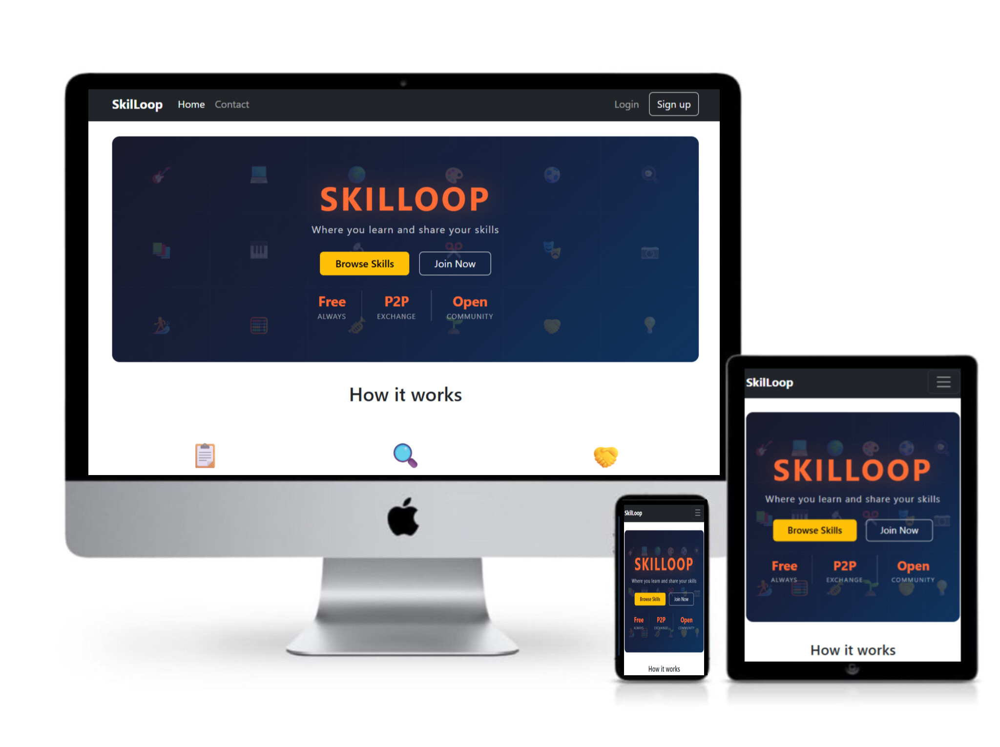
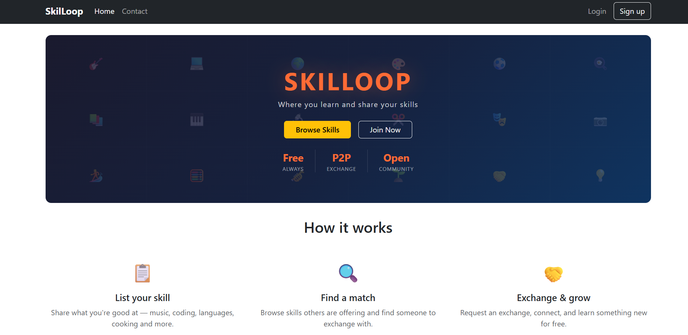
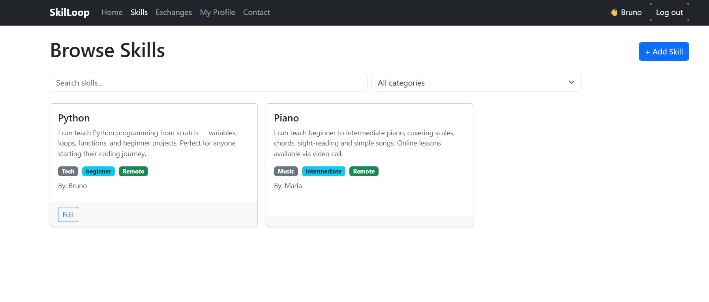
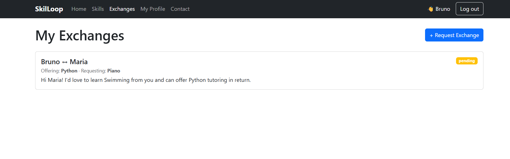
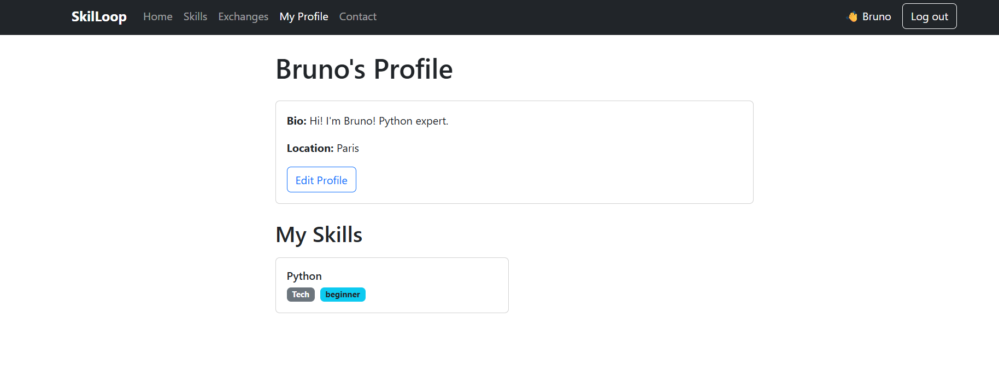
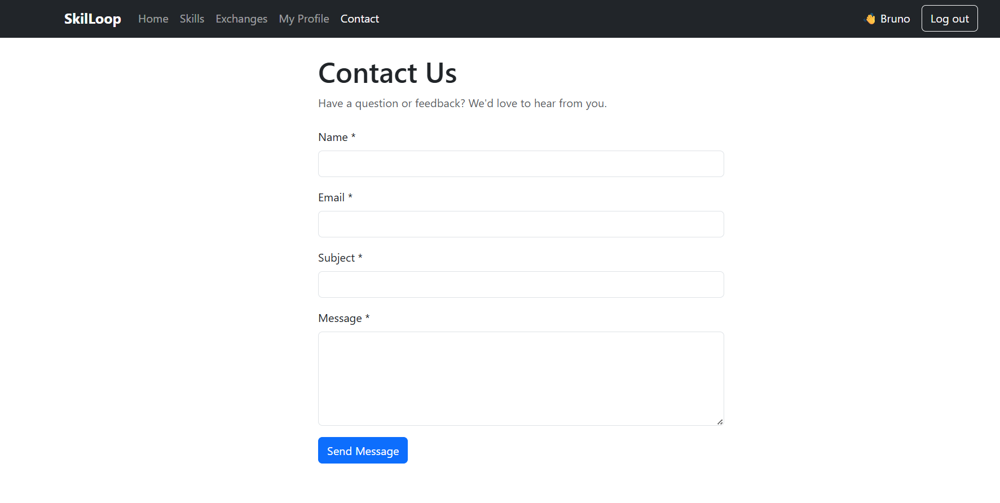

# 📚 SkilLoop Frontend
## 🚀 Overview

A skill-sharing web application built with React and Django REST Framework. Users can offer skills, browse what others teach, and request skill exchanges.

Live site: https://skillloopfrontend-952dcb19a921.herokuapp.com

Backend API: https://skillloop-api-hbica-3bb338c1557b.herokuapp.com

## Screenshots
The following screenshots demonstrate the core features and user interface of the SkilLoop application.



### Home page

The home page introduces users to SkillLoop and provides a clear call-to-action to explore skills or sign up. It highlights the purpose of the platform — enabling users to exchange skills with others.

### Skills list

The skills page displays all available skills shared by users.  
Users can:
- [Search for skills](docs/screenshots/search.png)
- [Filter by category](docs/screenshots/filter.png)

- View details of each skill
- [Request a skill exchange](docs/screenshots/request-exchange.png)

### Exchanges


This page allows users to manage their skill exchanges.  
Users can:
- View incoming and outgoing requests
- Accept or decline requests
- Mark exchanges as completed

### My Profile Page


The profile page allows users to manage their personal information.  
Users can:
- Edit their bio and location
- View their posted skills
- Track their activity on the platform

### Contact us Page

The contact page allows users to send messages to the platform administrators.  
For logged-in users, the email field is automatically pre-filled to improve usability.


---

# Table of Contents

1. [🎯 Project Purpose](#project-purpose)
2. [User Stories](#user-stories)
3. [UX Design](#ux-design)
4. [Features](#features)
5. [React Architecture](#react-architecture)
6. [Tech Stack](#tech-stack)
7. [API Integration](#api-integration)
8. [Testing](#testing)
9. [Bugs](#bugs)
10. [Deployment](#deployment)
11. [Credits](#credits)
12. [Agile Development](#agile-development)
13. [Accessibility](#accessibility) 

# 🎯 Project Purpose
SkilLoop is a collaborative learning platform where users exchange skills instead of paying for courses. A user who knows Python can offer tutoring in exchange for Guitar lessons from someone else — no money changes hands.


## Target Audience
- Students and self-learners
- Professionals seeking peer-to-peer learning
- Anyone who wants to teach what they know and learn something new
---

# Project Goals

| Goal                                     | Implementation                              |
|------------------------------------------|---------------------------------------------|
| Let users offer and discover skills      | Skills list with search and category filter |
| Enable peer connections                  | Skill exchange request system               |
| Give users control over their content    | Full CRUD on own skills and profile         |
| Keep the platform accessible to visitors | Public skills list, registration open to all|    

---

# User Stories
User stories are tracked on the GitHub Projects board.

## Issue #1 — User Authentication

|             Story                                                             |   Acceptance Criteria                                 |
|-------------------------------------------------------------------------------|-------------------------------------------------------|
| As a new user I want to register so I can start using SkillLoop               | Registration form validates input and creates account |
| As a registered user I want to log in so I can access my profile and interact | Login returns token, navbar updates to show username  |
| As a logged-in user I want to log out safely so I can secure my information   | Token cleared, user redirected, navbar resets         |

## Issue #2 — Skill Sharing

|             Story                                                             |   Acceptance Criteria                                 |
|-------------------------------------------------------------------------------|-------------------------------------------------------|
| As a logged-in user I want to create a skill post so I can share what I teach | Form validates, POST to API, skill appears in list |
| As a visitor I want to browse available skills so I can learn what's being offered | Skills list loads on `/skills`, search and filter work |
| As a logged-in user I want to edit or delete my own posts so I can manage my offerings | Edit and Delete buttons only shown to skill owner |

## Issue #3 — Social Interaction (Exchanges)

|             Story                                                             |   Acceptance Criteria                                 |
|-------------------------------------------------------------------------------|-------------------------------------------------------|
| As a logged-in user I want to send a skill exchange request so I can connect with other users | Exchange form posts to API, appears in list with "pending" badge |
| As a logged-in user I want to accept or decline exchange requests so I can manage my interactions | Accept/Decline buttons only shown to the recipient |
| As a logged-in user I want to view my exchanges so I can track my skill-sharing activity |Exchanges page shows all where user is requester or recipient |

# UX Design
## 🎨 Design Goals
- Simple, uncluttered navigation
- Clear feedback on all user actions (success toasts, error alerts)
- Minimal friction — users can browse skills without logging in
- Responsive across mobile, tablet and desktop

# Wireframes
The following wireframes were created during planning:

## Home page

+----------------------------------+
| SkilLoop   Home Skills Exchanges|
+----------------------------------+
|                                  |
|   Welcome to SkillLoop           |
|   Share skills. Learn together.  |
|   [Browse Skills] [Get Started]  |
|                                  |
+----------------------------------+

## Skills list page

+----------------------------------+
| Browse Skills          [+Add]    |
| [Search...]  [Category v]        |
|                                  |
| +--------+ +--------+ +--------+ |
| |Title   | |Title   | |Title   | |
| |desc... | |desc... | |desc... | |
| |cat|lvl | |cat|lvl | |cat|lvl | |
| |By: user| |By: user| |By: user| |
| [View][Ed]| [View]  | [View]  | |
| +--------+ +--------+ +--------+ |
+----------------------------------+

## Exchanges page

+----------------------------------+
| My Exchanges    [+Request]       |
|                                  |
| +------------------------------+ |
| | userA <-> userB    [pending] | |
| | Offering: Python             | |
| | Requesting: Guitar           | |
| | [Accept] [Decline]           | |
| +------------------------------+ |
+----------------------------------+

## Profile page

+----------------------------------+
| username's Profile               |
| Bio: ...         [Edit Profile]  |
| Location: ...                    |
|                                  |
| My Skills                        |
| +----------+ +----------+        |
| | Skill 1  | | Skill 2  |        |
| +----------+ +----------+        |
+----------------------------------+

# Colour Scheme and Typography
- Primary: Bootstrap default blue (#0d6efd) for actions
- Success: Green for positive states (accepted, remote badge)
- Warning: Amber for pending states
- Danger: Red for declined/delete actions
- Typography: Bootstrap default (system font stack) for readability
---

# Navigation Structure
/ (Home)
/skills (public)
/skills/new (protected)
/skills/:id/edit (protected, owner only)
/exchanges (protected)
/profile (protected)
/contact (public)
---

# Features
## Authentication
- Registration with username, email and password
- Login returns a DRF Token stored in localStorage and set as axios default header
- Logout clears token and resets state
- Navbar shows logged-in username and logout button when authenticated
---

## Skills
- Browse all skills — available to visitors without login
- Search by keyword (title, description, category)
- Filter by category (Music, Tech, Languages, Arts, Sport, Other)
- Create a skill (logged-in users only)
- Edit and delete own skills with confirmation dialog
- Skill cards show title, description, category badge, level badge, remote badge and owner

## Skill Exchanges
- Request an exchange — select recipient, skill offered, skill requested, optional message
- Recipient dropdown excludes the logged-in user
- Offered skills dropdown shows only the logged-in user's own skills
- Requested skills dropdown shows only other users' skills
- Accept / Decline — only shown to the recipient of a pending request
- Mark as completed — only shown to the requester of an accepted exchange
- Skill names shown instead of IDs

## Profile
- View own profile (bio, location, skills)
- Edit bio and location with character limit validation
- Own skills listed as cards

## Contact
- Public contact form (no login required)
- Fields: name, email, subject, message — all required
- Success screen shown after submission

## UX Details
- All forms include client-side validation with inline error messages
- Success toasts appear on create/edit/update actions
- Error alerts shown on API failures
- Login state always visible in navbar
- Protected routes redirect unauthenticated users to login

# React Architecture
## Component Structure

src/
  api/
    config.js          — API base URL config
  assets/
    hero-bg.png.png    — Hero image
  components/
    Navbar.js          — Persistent navigation, auth-aware
    ProtectedRoute.js  — Wraps protected pages, redirects if not logged in
  context/
    AuthContext.js     — Global auth state, login/logout/register functions
  hooks/
    useSkills.js       — Custom hook for fetching skills with search/filter
  pages/
    Home.js
    Login.js
    Register.js
    Skills.js          — Skills list with search and filter
    SkillForm.js       — Create and edit skill (shared form)
    Exchanges.js       — View, request, accept/decline exchanges
    Profile.js         — View and edit own profile
    Contact.js         — Public contact form

## Reusable Components and Patterns
`ProtectedRoute` wraps any page that requires authentication. Used in `App.js` for `/skills/new`, `/skills/:id/edit`, `/exchanges`, and `/profile`.

`SkillForm` handles both create and edit flows. The same component is mounted at `/skills/new` and `/skills/:id/edit`. It detects edit mode via `useParams()` and conditionally fetches existing data and shows a Delete button.

`useSkills` custom hook encapsulates all skill-fetching logic — API call, search params, category params, loading state and error state. Used by `Skills.js`, keeping the page component clean.

`AuthContext` provides `currentUser`, `token`, `login`, `logout` and `register` to the entire app via React Context. Axios default headers are set automatically when the token changes.

## Separation of Concerns

- API configuration is isolated in `src/api/config.js`
- Auth logic lives entirely in `AuthContext.js`
- Data fetching for skills is abstracted into `useSkills.js`
- Pages handle layout and user interaction only
- No business logic is duplicated across components
---

# Tech Stack

| Technology | Purpose |
|-----------------------------|---------------------------|
| React 18 | Frontend framework |
| React Router v6 | Client-side routing |
| Axios | HTTP requests to the API |
| Bootstrap 5 / React-Bootstrap | Responsive UI components |
| Context API | Global authentication state |
| localStorage | Token persistence across sessions |
| Django REST Framework | Backend API |
| dj-rest-auth | Token authentication endpoints |

# API Integration
The frontend communicates with the Django REST API via Axios. The base URL is set in `src/api/config.js` and reads from the `REACT_APP_API_BASE` environment variable.

Authentication uses DRF Token auth. On login, the token is stored in `localStorage` and set as the `Authorization` header on all subsequent Axios requests.

### Endpoints Used

| Endpoint | Method | Auth required | Purpose |
|---|---|---|---|
| /dj-rest-auth/login/ | POST | No | Login |
| /dj-rest-auth/registration/ | POST | No | Register |
| /dj-rest-auth/logout/ | POST | Yes | Logout |
| /dj-rest-auth/user/ | GET | Yes | Get current user |
| /api/skills/ | GET | No | List skills |
| /api/skills/ | POST | Yes | Create skill |
| /api/skills/:id/ | GET | No | Retrieve skill |
| /api/skills/:id/ | PUT | Yes (owner) | Update skill |
| /api/skills/:id/ | DELETE | Yes (owner) | Delete skill |
| /api/exchanges/ | GET | Yes | List own exchanges |
| /api/exchanges/ | POST | Yes | Create exchange |
| /api/exchanges/:id/ | PATCH | Yes | Update exchange status |
| /api/profiles/ | GET | No | List profiles |
| /api/profile/me/ | GET | Yes | Get own profile |
| /api/profile/me/ | PATCH | Yes | Update own profile |
| /api/contact/ | POST | No | Submit contact message |

---

## Testing

### Manual Testing

| Feature | Action | Expected | Result |
|---|---|---|---|
| Register | Submit valid form | Account created, logged in, redirected | Pass |
| Register | Submit with missing fields | Inline validation errors shown | Pass |
| Login | Submit valid credentials | Token received, navbar updates | Pass |
| Login | Submit wrong password | Error message shown | Pass |
| Logout | Click logout | Token cleared, redirected to home | Pass |
| Browse skills | Visit /skills | All skills displayed as cards | Pass |
| Search skills | Type in search box | Cards filter in real time | Pass |
| Filter by category | Select category dropdown | Only matching skills shown | Pass |
| Create skill | Submit valid form (logged in) | Skill created, redirected to /skills | Pass |
| Create skill | Submit empty form | Validation errors shown | Pass |
| Create skill logged out | Visit /skills/new | Redirected to /login | Pass |
| Edit skill | Submit changes | Skill updated, redirected to /skills | Pass |
| Delete skill | Confirm deletion | Skill removed, redirected to /skills | Pass |
| Request exchange | Fill form and submit | Exchange created with pending status | Pass |
| Accept exchange | Click Accept as recipient | Status changes to accepted | Pass |
| Decline exchange | Click Decline as recipient | Status changes to declined | Pass |
| Complete exchange | Click Complete as requester | Status changes to completed | Pass |
| View profile | Visit /profile logged in | Profile data and skills shown | Pass |
| Edit profile | Submit bio/location update | Profile updated, success toast shown | Pass |
| Contact form | Submit valid message | Success screen shown | Pass |
| Contact form | Submit empty fields | Validation errors shown | Pass |
| Protected routes | Visit /exchanges logged out | Redirected to /login | Pass |
| Responsiveness | View on mobile viewport | Layout adapts, no overflow | Pass |

---

## Bugs

### Fixed Bugs

**Bug 1 — Skills search and category filter not working**

The API SkillListCreateView had a static queryset with no filtering logic. The frontend was correctly sending search and category query params but the API ignored them. Fixed by overriding get_queryset() in the view to apply Q filters for search and category__iexact for category filtering.

**Bug 2 — Exchange form showed skill IDs instead of titles**

The SkillExchangeSerializer returned skill_offered and skill_requested as integer IDs. Fixed on the frontend by fetching the full skills list on page load and using a skillTitle(id) helper function to look up and display the human-readable skill name.

**Bug 3 — API responses with and without pagination**

Some API endpoints return a paginated object with a results array, others return a plain array. Fixed throughout the app using the pattern: data.results ?? data to handle both shapes safely.

### Known Issues

- No loading spinners — plain text is shown during API calls (planned improvement)
- No dedicated 404 page — unknown routes redirect to home via catch-all route
- Contact form does not pre-fill email for logged-in users (planned improvement)

---

## Deployment

### Prerequisites

- Node.js and npm installed
- Heroku CLI installed
- Heroku account created

### Local Development

1. Clone the repository:
```
git clone https://github.com/HBica05/skillloop-frontend.git
cd skillloop-frontend/my-app
```

2. Install dependencies:
```
npm install
```

3. Create a .env file in the project root:
```
REACT_APP_API_BASE=http://localhost:8000
```

4. Start the development server:
```
npm start
```

### Heroku Deployment

1. Create a Heroku app:
```
heroku create your-app-name
```

2. Set the buildpack:
```
heroku buildpacks:set heroku/nodejs
```

3. Set environment variables:
```
heroku config:set REACT_APP_API_BASE=https://your-api-name.herokuapp.com
```

4. Deploy:
```
git push heroku main
```

### Environment Variables

| Variable | Description |
|---|---|
| REACT_APP_API_BASE | Base URL of the deployed Django REST API |

The .env file is listed in .gitignore and is never committed to the repository.

---

## Credits

### Technologies

- React — https://reactjs.org
- React Router — https://reactrouter.com
- Axios — https://axios-http.com
- Bootstrap — https://getbootstrap.com
- Django REST Framework — https://www.django-rest-framework.org
- dj-rest-auth — https://dj-rest-auth.readthedocs.io

### Learning Resources

- Code Institute — course material and project brief
- Inspirational videos:
  - https://youtu.be/Q0XY7wuoqfg
  - https://youtu.be/WbV3zRgpw_E

### Tools

- Claude AI — development assistance and code review
- ChatGPT — development assistance
- GitHub — version control and project management
- Canva — hero background image design (https://www.canva.com)

## Agile Development

This project was developed using Agile methodology. User stories were created as GitHub Issues and tracked on a GitHub Projects board with To Do, In Progress and Done columns.

## Accessibility

- Semantic HTML elements used throughout
- All form inputs have associated labels
- aria-required attributes on required fields
- Bootstrap components follow WCAG accessibility standards

---

## Author

Haadiyah Bica  
GitHub: https://github.com/HBica05

---
[⬆ Back to top](#skilloop-frontend)
